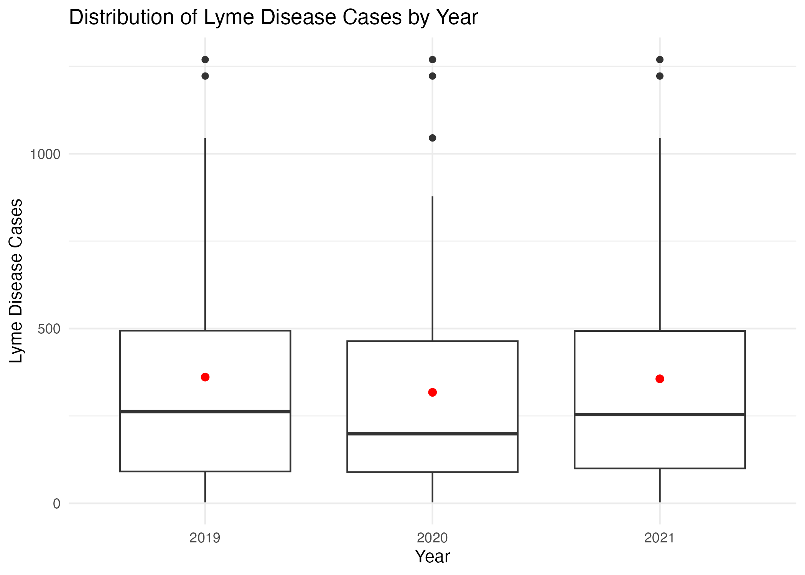

<<<<<<< HEAD
Here we can report findings from each of our analyses. 

```{r}
knitr::opts_chunk$set(echo = FALSE, warning = FALSE)
options(repos = c(CRAN = "https://cloud.r-project.org"))
```

# EDA

## Mary's Exploratory Analysis
```{r}
install.packages("remotes")
install.packages("broom.helpers")
remotes::install_github("ddsjoberg/gtsummary")
library(tidyverse)
library(rvest)
library(sf)
library(purrr)
library(knitr)
library(readxl)
library(gtsummary)
library(gt)
```

```{r}
# Download dataset 
tick_lyme_weather <- read.csv("tick_lyme_weather.csv")
# Correct the names for Cattaraugus and St. Lawrance in the dataset
tick_lyme_weather <- tick_lyme_weather |>
  mutate(
    name = case_when(
      name == "Cattaragus" ~ "Cattaraugus",
      name == "St Lawrence" ~ "St. Lawrence",
      TRUE ~ name))
```
=======

# Exploratory Findings

<div style="text-align: center;">
  <a href="table.1.html">
    Click to view Table 1. Summary statistics including number of cases, percent of ticks with bacteria that causes Lyme disease, and average temperature over the course of three years.
  </a>
</div>

<br> 

 

>>>>>>> 69d70ab7fe3cc7cd6bb7adf9bb4e9851d82ed8ce

<br>


<br>

<<<<<<< HEAD
### Relationship between lyme_count and average temperatures per month
```{r}
lyme_vs_avg_temp <- lm(lyme_count ~ jan_19 + feb_19 + mar_19 + apr_19 + may_19 + jun_19 + jul_19 + aug_19 + sep_19 + oct_19 + nov_19 + dec_19 + jan_20 + feb_20 + mar_20 + apr_20 + may_20 + jun_20 + jul_20 + aug_20 + sep_20 + oct_20 + nov_20 + dec_20+ jan_21 + feb_21 + mar_21 + apr_21 + may_21 + jun_21 + jul_21 + aug_21 + sep_21 + oct_21 + nov_21 + dec_21, data = tick_lyme_weather)

broom::tidy(lyme_vs_avg_temp) |> select(term, estimate, p.value) |>knitr::kable(digits =3)
```
Considering that Lyme is generally less prevalent in cold temperature, it makes sense that there is a significantly negative number of lyme in below freezing temperatures. There is a large amount of variation of estimate between each month with not much of a pattern. 
=======


<br>


>>>>>>> 69d70ab7fe3cc7cd6bb7adf9bb4e9851d82ed8ce


<<<<<<< HEAD
broom::tidy(lyme_rate_vs_population) |> select(term, estimate, p.value) |>knitr::kable(digits =3)
```
This linear regression analyzes the relationship between Lyme rate and tick population density and total ticks collected. Intercept estimate was 121 (SE: 16.4), with a test statistic of 7.39 and p-value<0.005. Therefore the intercept is highly significant, however the predictors are not. This demonstrates a weak association between Lyme rates and the variables. 
=======
<br>
>>>>>>> 69d70ab7fe3cc7cd6bb7adf9bb4e9851d82ed8ce


<br>


<br>

 


<br>


<<<<<<< HEAD
#Examination of log-linear regression 
log_model <- lm(log_lyme_count ~ log_total_ticks + log_tick_density + b_burgdorferi_percent, data = tick_lyme_weather_log)


coefficients_table <- broom::tidy(log_model) |>
  select(term, estimate, p.value) |>
  knitr::kable(digits = 3, caption = "Regression Coefficients")

# Extract model summary statistics
model_summary <- glance(b_burgdorferi_percent_vs_population)
summary_table <- data.frame(
  `Residual Standard Error` = model_summary$sigma,
  `Multiple R-squared` = model_summary$r.squared,
  `Adjusted R-squared` = model_summary$adj.r.squared,
  `F-statistic` = model_summary$statistic,
  `p-value` = model_summary$p.value
) |>
  knitr::kable(digits = 3, caption = "Model Summary")

# Print all tables
print(coefficients_table)
print(summary_table)
```
The logarithmic analysis found that the total number of ticks found and the B. burgdoferi percent had a positive, significant association with increased lyme disease rates. 
The low R^2 value demonstrates significant variability. Therefore further analysis with environmental, demographic and behavioral data would be beneficial. 

# Statistics

## Kaleb Analytic Edits:

```{r}
# Boxplot of 'lyme_count' per 'year'

data =
  read_csv("./combined_data_kf.csv")

# Fix mispells of Cattaraugus and St. Lawrance
data <- data %>%
  mutate(
    name = case_when(
      name == "Cattaragus" ~ "Cattaraugus",
      name == "St Lawrence" ~ "St. Lawrence",
      TRUE ~ name))
```

```{r}

histogram_cases = 
  data |>
  ggplot(aes(x = lyme_count)) +
  geom_histogram(aes(y = ..density..), 
                 binwidth = 1, 
                 fill = "blue",
                 alpha = 0.7, 
                 color = "black") +
  labs(
    title = "Distribution of all cases",
    x = "Cases of Lyme Disease",
    y = "Density"
  ) +
  theme_minimal()


# Boxplot of 'lyme_count' per 'year' with mean
boxplots =
  data |>
  ggplot(aes(x = factor(year), y = lyme_count)) +
  geom_boxplot() +
  stat_summary(
    fun = mean,
    geom = "point",
    shape = 20,
    size = 3,
    color = "red",
    fill = "red"
  ) +
  labs(
    title = "Distribution of Lyme Disease Cases by Year",
    x = "Year",
    y = "Lyme Disease Cases"
  ) +
  theme_minimal()

histogram_cases
boxplots

# cases are right skewed

data = 
  data |> 
  mutate(log_cases = log10(lyme_count))

histogram_logcases = 
  data |>
  ggplot(aes(x = log_cases)) +
  geom_histogram(aes(y = ..density..), 
                 binwidth = 0.5, 
                 fill = "blue",
                 alpha = 0.7, 
                 color = "black") +
  labs(
    title = "Distribution of all cases",
    x = "Cases of Lyme Disease",
    y = "Density"
  ) +
  theme_minimal()

histogram_logcases

ggsave(
  filename = "histogram_cases.png",
  plot = histogram_cases     
)

ggsave(
  filename = "boxplots_cases_year.png",
  plot = boxplots        
)

ggsave(
  filename = "histogram_log_cases.png", 
  plot = histogram_logcases
)

#log10 transformation makes outcome a bit better distributed. 
```


```{r}
# Step 2: Histogram and density plot for average temperature

histogram_temp = 
  data |>
  ggplot(aes(x = avg_temp)) +
  geom_histogram(aes(y = ..density..), 
                 binwidth = 1, 
                 fill = "blue",
                 alpha = 0.7, 
                 color = "black") +
  labs(
    title = "Distribution of Average Temperature",
    x = "Average Temperature",
    y = "Density"
  ) +
  theme_minimal()

histogram_temp

# temperature is normally distributed

ggsave(
  filename = "temperature_distribution.png",
  plot = histogram_temp
)

```


```{r}
# Step 3: Histogram and density plot for 'prev_badtick'

dis_bad_tick_per = 
  data |>
  ggplot(aes(x = b_burgdorferi_percent)) +
  geom_histogram(aes(y = ..density..), binwidth = 0.05, fill = "green", alpha = 0.7, color = "black") +
  geom_density(alpha = 0.3, fill = "purple") +
  labs(
    title = "Distribution of prev_badtick",
    x = "Prevalence of Bad Tick",
    y = "Density"
  ) +
  theme_minimal()

dis_bad_tick_per

ggsave(
  filename = "tickwithbdistribution.png",
  plot = dis_bad_tick_per
)

# percentage of ticks sampled carrying lyme-causing bacteria is normally distributed

```

```{r}
# Step 4: Line plot of total cases per year
annual_cases <- data %>%
  group_by(year) %>%
  summarize(total_cases = sum(lyme_count, na.rm = TRUE))

cases_per_year = 
  annual_cases |> 
  ggplot(aes(x = year, y = total_cases)) +
  geom_point(color = "red", size = 2) +
  geom_smooth() + 
  labs(
    title = "Total Case Count by Year",
    x = "Year",
    y = "Total Case Count"
  ) +
  theme_minimal()

cases_per_year
ggsave(
  filename = "cases_per_year.png",
  plot = cases_per_year
)


```

```{r}
# Regression model of case_count on prev_badtick controlling for avg_temperature
model <- lm(log_cases ~ b_burgdorferi_percent + avg_temp, data = data)
summary(model)

regression_table = 
  tbl_regression(
  model,
  intercept = TRUE,
  label = list(
    b_burgdorferi_percent ~ "% Ticks Carry",
    avg_temp ~ "Avg Temp"
  )
)

regression_table

gt_table = 
  as_gt(regression_table)
```

```{r}
# Step 6: Create a summary statistics table (Table 1) for each county
table1 = 
  data |> 
  select(name, lyme_count, avg_temp, b_burgdorferi_percent) |> 
  tbl_summary(
    by = name,
    statistic = list(
      all_continuous() ~ "{mean} ({sd})",
      all_categorical() ~ "{n} / {N} ({p}%)"
    ),
    digits = all_continuous() ~ 2
  ) %>%
  add_overall() %>%
  bold_labels() 

# Display the summary table
table1

library(dplyr)
library(gt)

# Calculate summary statistics for each county
summary_stats <- data %>%
  group_by(name) %>%
  summarize(
    years_with_data = n(),
    lyme_count_mean = mean(lyme_count, na.rm = TRUE),
    avg_temp_mean = mean(avg_temp, na.rm = TRUE),
    avg_temp_sd = sd(avg_temp, na.rm = TRUE),
    b_burgdorferi_percent_mean = mean(b_burgdorferi_percent, na.rm = TRUE),
    b_burgdorferi_percent_sd = sd(b_burgdorferi_percent, na.rm = TRUE)
  ) %>%
  ungroup()

# Create a gt table
summary_table <- summary_stats %>%
  gt(rowname_col = "name") %>%
  fmt_number(
    columns = vars(years_with_data, lyme_count_mean, avg_temp_mean, avg_temp_sd, b_burgdorferi_percent_mean, b_burgdorferi_percent_sd),
    decimals = 2
  ) %>%
  cols_label(
    years_with_data = "Non-Missing Years",
    lyme_count_mean = "All Year Mean Lyme Cases",
    avg_temp_mean = "Mean Temperature",
    avg_temp_sd = "SD",
    b_burgdorferi_percent_mean = "Mean B. burgdorferi % ",
    b_burgdorferi_percent_sd = "SD"
  ) %>%
  tab_header(
    title = "Summary Statistics by County"
  )

# Display the table
summary_table

```
=======
# Model Findings

<div style="text-align: center;">
  <a href="regress.html">
    Click here to view Table 2. Regression output of the model assessing the relationship between percent of ticks with bacteria that causes Lyme disease in a given county and that county's Lyme disease cases.
  </a>
</div> 
>>>>>>> 69d70ab7fe3cc7cd6bb7adf9bb4e9851d82ed8ce
