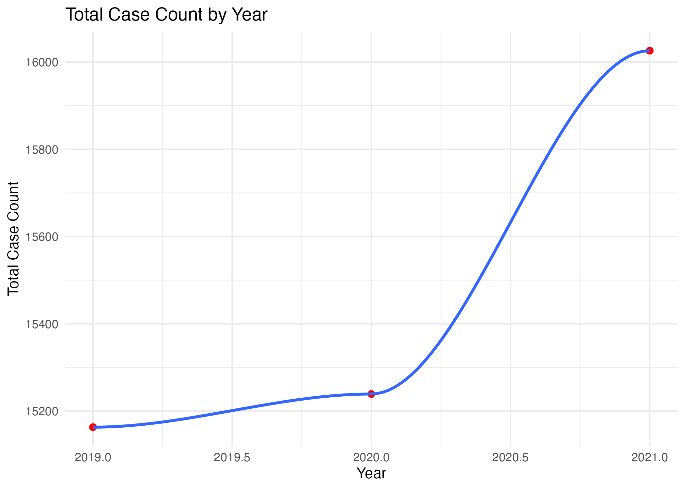
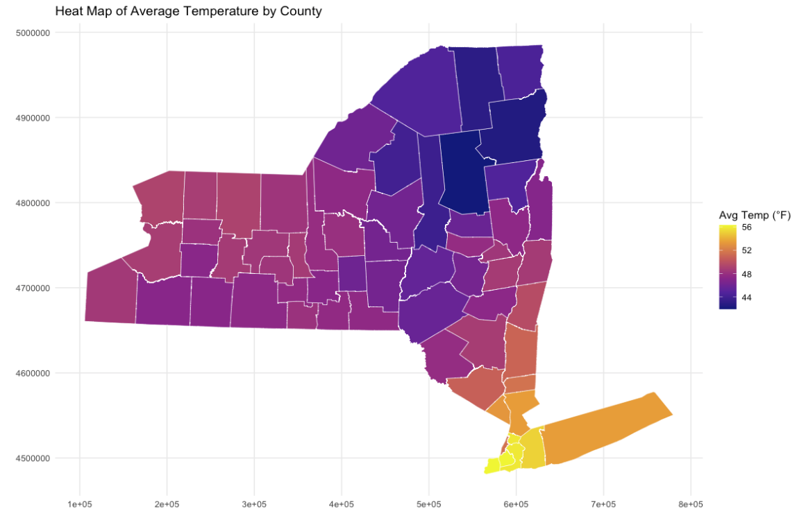

  <a href="table.1.html">
    Click to view Table 1. Summary statistics including number of cases, percent of ticks with bacteria that causes Lyme disease, and average temperature over the course of three years.
  </a>

  

 

 

 

 

 

 

 

 

 

# Results of Regression Analysis

  <a href="regress.html">
    Click here to view Table 2. Regression output of the model assessing the relationship between percent of ticks with bacteria that causes Lyme disease in a given county and that county's Lyme disease cases.
  </a>

 
